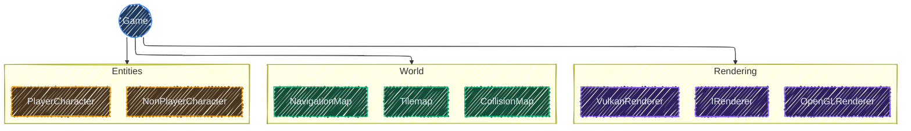
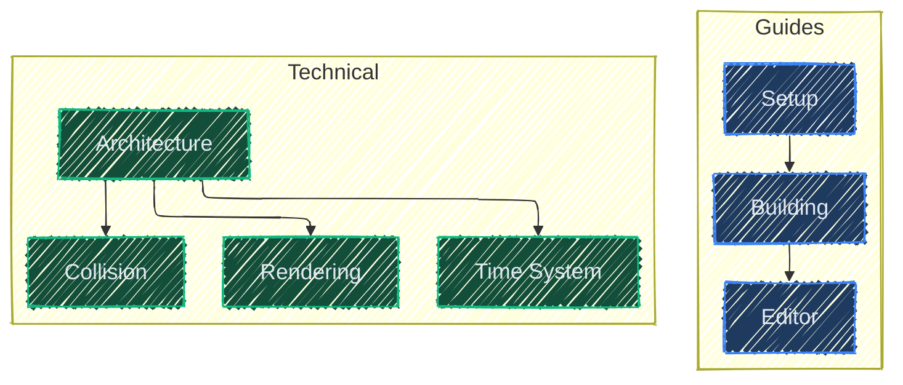

<div align="center">

# Wild Game Engine
**A modern 2D game engine built with C++23.**

🏠 [Mainpage](./docs/MAINPAGE.md) • 🧱 [Building](./docs/BUILDING.md) • 🏛️ [Architecture](./docs/ARCHITECTURE.md) • 🤝 [Contributing](./CONTRIBUTING.md)

![Game Engine](https://img.shields.io/badge/Game_Engine-2D-blue.svg?style=flat&logo=data:image/svg+xml;base64,PHN2ZyBoZWlnaHQ9IjIwMHB4IiB3aWR0aD0iMjAwcHgiIHZlcnNpb249IjEuMSIgaWQ9Il94MzJfIiB4bWxucz0iaHR0cDovL3d3dy53My5vcmcvMjAwMC9zdmciIHhtbG5zOnhsaW5rPSJodHRwOi8vd3d3LnczLm9yZy8xOTk5L3hsaW5rIiB2aWV3Qm94PSIwIDAgNTEyIDUxMiIgeG1sOnNwYWNlPSJwcmVzZXJ2ZSIgZmlsbD0iI2ZmZmZmZiIgc3Ryb2tlPSIjZmZmZmZmIj48ZyBpZD0iU1ZHUmVwb19iZ0NhcnJpZXIiIHN0cm9rZS13aWR0aD0iMCI+PC9nPjxnIGlkPSJTVkdSZXBvX3RyYWNlckNhcnJpZXIiIHN0cm9rZS1saW5lY2FwPSJyb3VuZCIgc3Ryb2tlLWxpbmVqb2luPSJyb3VuZCI+PC9nPjxnIGlkPSJTVkdSZXBvX2ljb25DYXJyaWVyIj4gPHN0eWxlIHR5cGU9InRleHQvY3NzIj4gLnN0MHtmaWxsOiNmZmZmZmY7fSA8L3N0eWxlPiA8Zz4gPHBhdGggY2xhc3M9InN0MCIgZD0iTTUxMC40NDEsMzIyLjg5NGwtMjkuNzYtMTI2LjU2Yy0xNS4wNzMtNTYuMjUyLTY2LjA0Ny05NS4zNjMtMTI0LjI4Ni05NS4zNjNIMTU1LjYwNCBjLTU4LjIzOSwwLTEwOS4yMTIsMzkuMTEtMTI0LjI4NSw5NS4zNjNsLTI5Ljc2LDEyNi41NmMtNy42MTgsMzYuMzAzLDEzLjM0LDcyLjUyNCw0OC42MjYsODQuMDAxbDEuNzQsMC41NTggYzMyLjY1OCwxMC42MzIsNjguMjg4LTMuMDcsODUuNDI5LTMyLjgzMWwyNS44OTQtMzguMjg5YzYuNTAyLTExLjI4OCwxOC41MzgtMTguMjUsMzEuNTUtMTguMjVoMTIyLjQwNiBjMTMuMDEyLDAsMjUuMDQ4LDYuOTYyLDMxLjU0OSwxOC4yNWwyNS44OTQsMzguMjg5YzE3LjE0MiwyOS43NjEsNTIuNzc5LDQzLjQ2Myw4NS40MzgsMzIuODMxbDEuNzMyLTAuNTU4IEM0OTcuMSwzOTUuNDE4LDUxOC4wNiwzNTkuMTk3LDUxMC40NDEsMzIyLjg5NHogTTE5MS4wNDYsMjM4LjA4MWgtNDEuNjg5djQxLjY5NmgtMzYuMjk1di00MS42OTZINzEuMzczdi0zNi4yNzloNDEuNjg5di00MS42OCBoMzYuMjk1djQxLjY4aDQxLjY4OVYyMzguMDgxeiBNMzc0LjcyOCwxNTEuNDM2YzEyLjYyNiwwLDIyLjg0NywxMC4yMjEsMjIuODQ3LDIyLjg0OGMwLDEyLjYxLTEwLjIyMSwyMi44MzEtMjIuODQ3LDIyLjgzMSBjLTEyLjYxLDAtMjIuODMxLTEwLjIyMS0yMi44MzEtMjIuODMxQzM1MS44OTcsMTYxLjY1NiwzNjIuMTE4LDE1MS40MzYsMzc0LjcyOCwxNTEuNDM2eiBNMzI5LjA0OSwyNDIuODAxIGMtMTIuNjEsMC0yMi44MzktMTAuMjMtMjIuODM5LTIyLjg1NmMwLTEyLjYwMiwxMC4yMjktMjIuODMxLDIyLjgzOS0yMi44MzFjMTIuNjE4LDAsMjIuODM5LDEwLjIyOSwyMi44MzksMjIuODMxIEMzNTEuODg5LDIzMi41NzIsMzQxLjY2OCwyNDIuODAxLDMyOS4wNDksMjQyLjgwMXogTTM3NC43MjgsMjg4LjQ3MWMtMTIuNjEsMC0yMi44MzEtMTAuMjIxLTIyLjgzMS0yMi44MzEgYzAtMTIuNjI3LDEwLjIyMS0yMi44NDgsMjIuODMxLTIyLjg0OGMxMi42MjYsMCwyMi44NDcsMTAuMjIxLDIyLjg0NywyMi44NDhDMzk3LjU3NSwyNzguMjUsMzg3LjM1NCwyODguNDcxLDM3NC43MjgsMjg4LjQ3MXogTTQyMC40MDYsMjQyLjgwMWMtMTIuNjEsMC0yMi44MzItMTAuMjMtMjIuODMyLTIyLjg1NmMwLTEyLjYwMiwxMC4yMjItMjIuODMxLDIyLjgzMi0yMi44MzEgYzEyLjYxOCwwLDIyLjg0NywxMC4yMjksMjIuODQ3LDIyLjgzMUM0NDMuMjUzLDIzMi41NzIsNDMzLjAyNCwyNDIuODAxLDQyMC40MDYsMjQyLjgwMXoiPjwvcGF0aD4gPC9nPiA8L2c+PC9zdmc+)

![Status](https://img.shields.io/badge/Status-Development-yellow.svg?style=flat&logo=data:image/svg+xml;base64,PHN2ZyBmaWxsPSIjZmZmZmZmIiBoZWlnaHQ9IjIwMHB4IiB3aWR0aD0iMjAwcHgiIHZlcnNpb249IjEuMSIgaWQ9Ikljb25zIiB4bWxucz0iaHR0cDovL3d3dy53My5vcmcvMjAwMC9zdmciIHhtbG5zOnhsaW5rPSJodHRwOi8vd3d3LnczLm9yZy8xOTk5L3hsaW5rIiB2aWV3Qm94PSIwIDAgMzIgMzIiIHhtbDpzcGFjZT0icHJlc2VydmUiIHN0cm9rZT0iI2ZmZmZmZiI+PGcgaWQ9IlNWR1JlcG9fYmdDYXJyaWVyIiBzdHJva2Utd2lkdGg9IjAiPjwvZz48ZyBpZD0iU1ZHUmVwb190cmFjZXJDYXJyaWVyIiBzdHJva2UtbGluZWNhcD0icm91bmQiIHN0cm9rZS1saW5lam9pbj0icm91bmQiPjwvZz48ZyBpZD0iU1ZHUmVwb19pY29uQ2FycmllciI+IDxnPiA8cGF0aCBkPSJNMjUuOCwyMi4xbC0wLjYtMS45bC0xNy40LTNsLTEuNSw0LjlDNSwyMi41LDQsMjMuNiw0LDI1djNjMCwwLjYsMC40LDEsMSwxaDIyYzAuNiwwLDEtMC40LDEtMXYtMyBDMjgsMjMuNiwyNywyMi41LDI1LjgsMjIuMXoiPjwvcGF0aD4gPHBvbHlnb24gcG9pbnRzPSIyMi44LDEyLjggOS45LDEwLjYgOC40LDE1LjMgMjQuNSwxOC4xICI+PC9wb2x5Z29uPiA8cGF0aCBkPSJNMjIuMSwxMC42TDIwLDMuN0MxOS44LDMuMywxOS40LDMsMTksM2gtNmMtMC40LDAtMC44LDAuMy0xLDAuN2wtMS42LDVMMjIuMSwxMC42eiI+PC9wYXRoPiA8L2c+IDwvZz48L3N2Zz4=)
![Windows](https://img.shields.io/badge/Windows-Supported-0078D6.svg?style=flat&logo=data:image/svg+xml;base64,PHN2ZyB2aWV3Qm94PSIwIDAgMjAgMjAiIHZlcnNpb249IjEuMSIgeG1sbnM9Imh0dHA6Ly93d3cudzMub3JnLzIwMDAvc3ZnIiB4bWxuczp4bGluaz0iaHR0cDovL3d3dy53My5vcmcvMTk5OS94bGluayIgZmlsbD0iI2ZmZmZmZiIgc3Ryb2tlPSIjZmZmZmZmIj48ZyBpZD0iU1ZHUmVwb19iZ0NhcnJpZXIiIHN0cm9rZS13aWR0aD0iMCI+PC9nPjxnIGlkPSJTVkdSZXBvX3RyYWNlckNhcnJpZXIiIHN0cm9rZS1saW5lY2FwPSJyb3VuZCIgc3Ryb2tlLWxpbmVqb2luPSJyb3VuZCI+PC9nPjxnIGlkPSJTVkdSZXBvX2ljb25DYXJyaWVyIj4gPHRpdGxlPndpbmRvd3MgWyNmZmZmZmZdPC90aXRsZT4gPGRlc2M+Q3JlYXRlZCB3aXRoIFNrZXRjaC48L2Rlc2M+IDxkZWZzPiA8L2RlZnM+IDxnIGlkPSJQYWdlLTEiIHN0cm9rZT0ibm9uZSIgc3Ryb2tlLXdpZHRoPSIxIiBmaWxsPSJub25lIiBmaWxsLXJ1bGU9ImV2ZW5vZGQiPiA8ZyBpZD0iRHJpYmJibGUtTGlnaHQtUHJldmlldyIgdHJhbnNmb3JtPSJ0cmFuc2xhdGUoLTYwLjAwMDAwMCwgLTc0MzkuMDAwMDAwKSIgZmlsbD0iI2ZmZmZmZiI+IDxnIGlkPSJpY29ucyIgdHJhbnNmb3JtPSJ0cmFuc2xhdGUoNTYuMDAwMDAwLCAxNjAuMDAwMDAwKSI+IDxwYXRoIGQ9Ik0xMy4xNDU4NjQ3LDcyODkuNDM0MjYgQzEzLjE1MDg3NzIsNzI5MS40MzMxNiAxMy4xNTY4OTIyLDcyOTQuODI5MjkgMTMuMTYxOTA0OCw3Mjk3LjQ2ODg0IEMxNi43NzU5Mzk4LDcyOTcuOTU3NTcgMjAuMzg5OTc0OSw3Mjk4LjQ2MTMgMjMuOTk3OTk1LDcyOTkgQzIzLjk5Nzk5NSw3Mjk1Ljg0ODczIDI0LjAwMjAwNSw3MjkyLjcxMTQ2IDIzLjk5Nzk5NSw3Mjg5LjcxMzExIEMyMC4zODA5NTI0LDcyODkuNzEzMTEgMTYuNzY0OTEyMyw3Mjg5LjQzNDI2IDEzLjE0NTg2NDcsNzI4OS40MzQyNiBNNCw3Mjg5LjQzNTI2IEw0LDcyOTYuMjIxNTMgQzYuNzI1ODE0NTQsNzI5Ni41ODkzMyA5LjQ1MTYyOTA3LDcyOTYuOTQxMTMgMTIuMTcyNDMxMSw3Mjk3LjM0MjkxIEMxMi4xNzc0NDM2LDcyOTQuNzE3MzYgMTIuMTcwNDI2MSw3MjkyLjA5MDggMTIuMTcwNDI2MSw3Mjg5LjQ2NTI0IEM5LjQ0NjYxNjU0LDcyODkuNDcwMjQgNi43MjM4MDk1Miw3Mjg5LjQyNjI3IDQsNzI4OS40MzUyNiBNNCw3MjgxLjg0MzQ0IEw0LDcyODguNjEwNzEgQzYuNzI1ODE0NTQsNzI4OC42MTc3MSA5LjQ1MTYyOTA3LDcyODguNTc2NzMgMTIuMTc3NDQzNiw3Mjg4LjU3OTczIEMxMi4xNzU0Mzg2LDcyODUuOTYwMTcgMTIuMTc1NDM4Niw3MjgzLjM0MzYxIDEyLjE3MjQzMTEsNzI4MC43MjQwNSBDOS40NDQ2MTE1Myw3MjgxLjA2NDg2IDYuNzE2NzkxOTgsNzI4MS40MjU2NyA0LDcyODEuODQzNDQgTTI0LDcyODguNDcxNzkgQzIwLjM4Nzk2OTksNzI4OC40ODU3OCAxNi43NzU5Mzk4LDcyODguNTQwNzUgMTMuMTYxOTA0OCw3Mjg4LjU1MTc1IEMxMy4xNTk4OTk3LDcyODUuODg5MjEgMTMuMTU5ODk5Nyw3MjgzLjIyOTY3IDEzLjE2MTkwNDgsNzI4MC41NjkxNCBDMTYuNzY4OTIyMyw3MjgwLjAxODQ0IDIwLjM4Mzk1OTksNzI3OS41MDA3MiAyMy45OTc5OTUsNzI3OSBDMjQsNzI4Mi4xNTgyNiAyMy45OTc5OTUsNzI4NS4zMTM1MyAyNCw3Mjg4LjQ3MTc5IiBpZD0id2luZG93cy1bI2ZmZmZmZl0iPiA8L3BhdGg+IDwvZz4gPC9nPiA8L2c+IDwvZz48L3N2Zz4=)


</div>

A modern 2D game engine built with C++23, featuring dual OpenGL/Vulkan rendering backends, dynamic world simulation, and a built-in level editor. Designed for tile-based RPGs with a focus on performance, flexibility, and visual polish.

<table align="center">
<tr>
<td>

> [!IMPORTANT]
> **Assets Not Included**
>
> This engine ships without game assets (sprites, tilesets, fonts, maps). To run the engine, you will need to provide your own:
> - Source free/open-licensed sprites and tilesets (e.g., from [OpenGameArt](https://opengameart.org/), [itch.io](https://itch.io/game-assets/free))
> - Place them in the `assets/` directory following the structure in [Project Structure](#project-structure)
> - Wire them into the engine by adjusting the loading paths (e.g., Game.cpp L233, L273)
>
> **The engine will not run without valid assets in place.**

</td>
</tr>
</table>

## Features

### Dual Rendering Backend
Switch between **OpenGL 4.6** and **Vulkan 1.4** at runtime with a single keypress (**F1**).

> [!WARNING]
> **Vulkan** is **work-in-progress**. Runtime switching can cause missing textures or visual glitches. **OpenGL is recommended** for now.

### Dynamic Day/Night Cycle
A complete time-of-day system drives ambient lighting, sky colors, celestial bodies, and atmospheric effects:

```mermaid
---
config:
  look: handDrawn
  theme: mc
  themeVariables:
    fontSize: 18px
  layout: elk
---
graph LR
    classDef night fill:#1a1a2e,stroke:#9aa4c0,stroke-width:2.5px,color:#ffffff,font-weight:800
    classDef dawn  fill:#614385,stroke:#d7a3ff,stroke-width:2.5px,color:#ffffff,font-weight:800
    classDef day   fill:#f39c12,stroke:#7a3e00,stroke-width:2.5px,color:#ffffff,font-weight:900
    classDef dusk  fill:#c0392b,stroke:#ff9a9a,stroke-width:2.5px,color:#ffffff,font-weight:800

    N["Night 🌙✨"]:::night --> D["Dawn 🌅🕊️"]:::dawn --> M["Morning ☀️🌿"]:::day --> A["Afternoon 🌞🕶️"]:::day --> DU["Dusk 🌇🔥"]:::dusk --> E["Evening 🌃🌟"]:::night --> N
```



- **Sun and moon god rays** with arc-based positioning
- **Star field** with shooting stars and atmospheric glow
- **Smooth color transitions** between time periods

### Multi-Layer Tilemap System
Efficient tile-based world rendering with 8 configurable layers:

```mermaid
---
config:
  look: handDrawn
  theme: mc
  themeVariables:
    fontSize: 18px
  layout: elk
---
flowchart LR
  classDef ov fill:#2e1f5e,stroke:#8b5cf6,stroke-width:2.5px,color:#e2e8f0,font-weight:800
  classDef fg fill:#134e3a,stroke:#10b981,stroke-width:2.5px,color:#e2e8f0,font-weight:800
  classDef ob fill:#4a3520,stroke:#f59e0b,stroke-width:2.5px,color:#e2e8f0,font-weight:800
  classDef gr fill:#1e3a5f,stroke:#3b82f6,stroke-width:2.5px,color:#e2e8f0,font-weight:800

  O["7–6 Overlay 🌦️✨<br/>UI - Weather 🧭"]:::ov
  F["5–4 Foreground 🧍‍♂️⚔️<br/>Front of Entities 👑"]:::fg
  B["3–2 Objects 🏠🪨🌲<br/>Buildings - Rocks - Trees 🧱"]:::ob
  G["1 Detail 🍃🛤️🪴<br/>Grass - Paths - Deco 🎨"]:::gr
  T["0 Ground 🗺️🟫<br/>Base Terrain 🌍"]:::gr

  O --> F --> B --> G --> T

```



### Advanced Rendering Features

```mermaid
---
config:
  look: handDrawn
  theme: mc
  themeVariables:
    fontSize: 18px
  layout: elk
---
flowchart TB
  classDef batch fill:#1e3a5f,stroke:#3b82f6,stroke-width:2.5px,color:#e2e8f0,font-weight:800
  classDef sort fill:#134e3a,stroke:#10b981,stroke-width:2.5px,color:#e2e8f0,font-weight:800
  classDef proj fill:#4a3520,stroke:#f59e0b,stroke-width:2.5px,color:#e2e8f0,font-weight:800
  classDef fx fill:#2e1f5e,stroke:#8b5cf6,stroke-width:2.5px,color:#e2e8f0,font-weight:800

  subgraph Pipeline["Rendering Pipeline 🎨🧩"]
    B["Sprite Batching 📦<br/>Draw Call Optimization 🚀"]:::batch
    Y["Y-Sorting 🧭<br/>Depth Ordering 🪜"]:::sort
    P["Perspective 👁️‍🗨️<br/>World Curvature 🌍"]:::proj
    N["No-Projection 🏗️<br/>Upright Structures 🧱"]:::proj
    FX["Particles ✨<br/>Zone Spawning 🌪️"]:::fx
  end

  B --> Y
  Y --> P
  Y --> N
  P --> FX
  N --> FX
```



- **Sprite batching** groups draw calls for optimal GPU efficiency
- **Y-sorting** ensures correct depth ordering of entities and tiles
- **Perspective projection** adds world curvature and vanishing point effects
- **No-projection tiles** keep buildings and signs upright
- **Particle systems** spawn effects within defined zones

### In-Game Level Editor
Press **E** to toggle a full-featured editor:
- Tile placement with multi-tile selection and rotation
- Collision and navigation map painting
- Tile elevation for height variation
- NPC placement and patrol route configuration
- Animation definition tools

### Entity System
- **Player character** with 8-directional movement and animation
- **NPCs** with autonomous patrol behavior and pathfinding
- **Dialogue system** supporting branching conversations with quests

## Architecture



## Technology Stack

| Component      | Technology              |
|----------------|-------------------------|
| Language       | C++23                   |
| Graphics       | OpenGL 4.6 / Vulkan 1.4 |
| Windowing      | GLFW 3.3+               |
| Math           | GLM                     |
| Image Loading  | stb_image               |
| Font Rendering | FreeType 2              |
| Build System   | CMake 3.10+             |

## Quick Start

### Prerequisites
- CMake 3.10+
- C++23 compatible compiler (MSVC 2022+)
- OpenGL 4.6 compatible GPU (or Vulkan 1.4 capable)

### Windows

```powershell
# 1. Clone the repository
git clone https://github.com/lextpf/wild.git
cd wild

# 2. Run setup script to download dependencies
.\setup.ps1

# 3. Build the project
.\build.bat

# 4. Run the game
.\build\Release\wild.exe
```

## Controls

### Gameplay

| Key         | Action                           |
|-------------|----------------------------------|
| W/A/S/D     | Move player (8-directional)      |
| Shift       | Run (1.5x speed)                 |
| B           | Toggle bicycle mode (2.0x speed) |
| F           | Talk to NPC when facing          |
| X           | Copy/restore NPC appearance      |
| C           | Cycle characters                 |
| Ctrl+Scroll | Zoom camera                      |
| Arrow Keys  | Pan camera                       |
| Z           | Reset zoom to 1.0x               |
| Space       | Free camera mode                 |

### Dialogue

| Key            |  Action                     |
|----------------|-----------------------------|
| W/S or Up/Down | Navigate dialogue options   |
| Enter/Space    | Confirm selection / advance |
| Escape         | End dialogue                |

### Movement Modes

| Mode    | Speed    | Collision              |
|---------|----------|------------------------|
| Walking | 100 px/s | Strict (full hitbox)   |
| Running | 150 px/s | Relaxed (center point) |
| Bicycle | 200 px/s | Relaxed (center point) |

### Editor

| Key          | Action                             |
|--------------|------------------------------------|
| E            | Toggle editor mode                 |
| 1-8          | Select tilemap layer               |
| T            | Toggle tile picker                 |
| R            | Rotate selection 90 deg            |
| Delete       | Remove tile at cursor              |
| S            | Save map to JSON                   |
| L            | Load map from JSON                 |
| M            | Toggle navigation editing          |
| N            | Toggle NPC placement               |
| H            | Toggle elevation editing           |
| B            | Toggle billboard projection        |
| Y            | Toggle Y-sort editing              |
| J            | Toggle particle zone editing       |
| K            | Toggle animated tile editing       |
| X            | Toggle corner cut blocking on tile |
| , / .        | Cycle types (NPC/particle/anim)    |
| Left Click   | Place tile/NPC/zone                |
| Right Click  | Toggle collision/navigation        |
| Arrows       | Pan tile picker                    |
| Shift+Arrows | Pan tile picker (fast)             |
| Scroll       | Pan tile picker                    |
| Ctrl+Scroll  | Zoom                               |

### Debug and Visual

| Key     | Action                                                 |
|---------|--------------------------------------------------------|
| F1      | Switch renderer (OpenGL/Vulkan)                        |
| F2      | Toggle debug overlays (collision, navigation, anchors) |
| F3      | Toggle FPS/position display                            |
| F4      | Toggle 3D globe effect                                 |
| F5      | Cycle time of day (day/evening/night/morning)          |
| Up/Down | Adjust 3D globe intensity                              |

For detailed editor controls, see the [Editor Guide](docs/EDITOR.md).

## Documentation



| Document                                         | Description                                         |
|--------------------------------------------------|-----------------------------------------------------|
| **[Setup Guide](docs/SETUP.md)**                 | Install dependencies and configure your environment |
| **[Building Guide](docs/BUILDING.md)**           | Compile on Windows                                  |
| **[Architecture](docs/ARCHITECTURE.md)**         | Engine design, game loop, system relationships      |
| **[Rendering Pipeline](docs/RENDERING.md)**      | Coordinate systems, transformations, batching       |
| **[Time System](docs/TIME_SYSTEM.md)**           | Day/night cycle, celestial mechanics, lighting      |
| **[Collision & Pathfinding](docs/COLLISION.md)** | AABB collision, navigation, NPC AI                  |
| **[Editor Guide](docs/EDITOR.md)**               | Level editor usage and tools                        |

### Generating API Docs

```powershell
# Install Doxygen
# Windows: choco install doxygen

# Generate documentation
doxygen Doxyfile

# Open docs/html/index.html in your browser
```

### File Formats

- **`.json`** - Map data (layers, tiles, NPCs)
- **`.png`** - Sprites (32-bit RGBA)
- **`.ttf`** - Fonts (TrueType)
- **`.vert/.frag`** - Shaders (GLSL 450)

## Project Structure

```
wild/
|-- src/                      # Source code
|   |-- main.cpp              # Entry point
|   |-- Game.cpp/h            # Core game loop and systems
|   |-- IRenderer.h           # Renderer interface
|   |-- OpenGLRenderer.*      # OpenGL backend
|   |-- VulkanRenderer.*      # Vulkan backend
|   |-- Tilemap.*             # World and tile management
|   |-- TimeManager.*         # Day/night cycle
|   |-- SkyRenderer.*         # Celestial rendering
|   |-- PlayerCharacter.*     # Player entity
|   |-- NonPlayerCharacter.*  # NPC entities
|   +-- ...
|-- assets/                   # Game assets
|   |-- sprites/              # Character and tile sprites
|   |-- fonts/                # TTF fonts
|   +-- maps/                 # JSON map files
|-- shaders/                  # GLSL shaders
|   |-- sprite.vert/frag      # Sprite rendering
|   +-- text.vert/frag        # Text rendering
|-- docs/                     # Documentation
+-- external/                 # Third-party dependencies
```

## Contributing

Contributions are welcome! Please read the [Contributing Guidelines](CONTRIBUTING.md) before submitting pull requests.

### Development Workflow
1. Fork the repository
2. Create a feature branch (`git checkout -b feature/amazing-feature`)
3. Make your changes
4. ~~Run tests and~~ Ensure the build passes
5. Commit with descriptive messages
6. Push to your fork and open a Pull Request

## License

This project is licensed under the MIT License - see the [LICENSE](LICENSE) file for details.

## Acknowledgments

- [GLFW](https://www.glfw.org/) - Window and input handling
- [GLM](https://github.com/g-truc/glm) - Mathematics library
- [stb_image](https://github.com/nothings/stb) - Image loading
- [FreeType](https://freetype.org/) - Font rendering
- [Vulkan SDK](https://vulkan.lunarg.com/) - Vulkan development tools
- [Claude](https://claude.ai/) - AI coding assistant by Anthropic
- [Codex](https://openai.com/index/openai-codex/) - AI coding assistant by OpenAI
- [DeviantArt](https://www.deviantart.com/) - Pixel art for characters and tilesets
- [Sora](https://openai.com/sora/) - Particle effect generation

